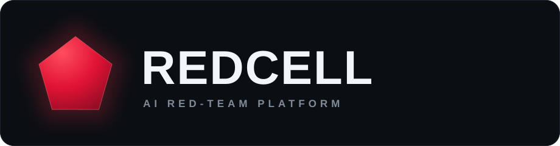
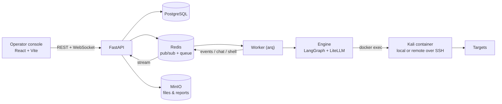

<p align="center">
  
</p>

<p align="center">
  <b>An AI red-team platform. Autonomous agents that recon, exploit, catch reverse shells, and write the report.</b>
</p>

<p align="center">
  
  
  
  
  
  
</p>

> [!WARNING]
> REDCELL runs real offensive tooling. Use it **only** against systems you own or are explicitly authorized to test. You are responsible for staying within scope and the law.

---

## What it is

REDCELL drives a team of LLM agents through a full engagement: an orchestrator plans and delegates, executor agents run real tools inside a Kali container, and everything streams live to an operator console. You steer the run from a chat, watch the agent graph and activity feed, interact with caught reverse shells in a terminal, and export a client-ready report when you are done.

It is provider-agnostic (OpenAI, Anthropic, Google, GLM, DeepSeek, Kimi, local Ollama, and more via LiteLLM), and every run is crash-resumable.

## Features

- **Multi-agent engine.** A LangGraph plan and act loop: an orchestrator delegates objectives to executor agents that run real shell tools and report back. Records findings, loot, and hosts as it goes.
- **Real execution, local or remote.** Tools run inside a Kali container via `docker exec`. Pick localhost or a saved server per session; a remote server runs the same container over SSH with host networking.
- **Reverse shells and listeners.** The agent opens a listener and catches a reverse shell; you get an interactive terminal on it. Open your own terminals and run commands in any of them.
- **Chat that controls the run.** Tell the chat what to do and it steers the live orchestrator or reopens a finished run to carry out new tasks. It answers questions about the engagement too.
- **Code-scan sessions.** Point a session at a public git repo or a local folder for an AI source-code security review, with findings mapped to file and line.
- **Per-session config.** Choose the execution server, the model, and whether traffic egresses through a proxy. Manage servers and proxies with a real connection test.
- **Professional reports.** Generate a client-ready PDF plus JSON and SARIF. The narrative is written by the session's model and humanized, with an executive summary, methodology, findings, and prioritized remediation.
- **Live everywhere.** Agent graph, activity feed, findings, loot, attack surface, terminals, listeners, and proxy history stream over WebSockets. Crash the worker or close the laptop and the run resumes.
- **Operator notifications.** In-app toasts, plus browser notifications when the tab is unfocused for the things that matter (the agent asking a question, a reverse shell caught, a critical finding).

## Architecture



The API never runs agents. It enqueues a run and the worker executes it, publishing live output onto Redis channels that the API forwards to the browser over WebSockets.

## Stack

Python 3.12, FastAPI, async SQLAlchemy + asyncpg, Alembic, arq, LangGraph, LiteLLM, ReportLab, PostgreSQL, Redis, MinIO, asyncssh. Frontend: React 18, Vite, TypeScript, Tailwind, TanStack Query, xterm. Tooling: uv (Python), bun (frontend).

## Quickstart

Prerequisites: Docker, [uv](https://docs.astral.sh/uv/), and [bun](https://bun.sh/).

```bash
# 1. infrastructure (Postgres, Redis, MinIO)
docker compose -f docker-compose.dev.yml up -d

# 2. Python deps, database, and seed data
uv sync --group live
uv run rc db upgrade
uv run rc seed              # admin user, provider catalog, buckets

# 3. copy the env template
cp .env.example .env

# 4. run the three processes (separate terminals)
cd apps/api    && uv run uvicorn app.main:app --host 127.0.0.1 --port 8080
cd apps/worker && uv run arq worker.settings.WorkerSettings
cd apps/web    && bun install && bun run dev
```

Open http://localhost:5183 and sign in with `admin` / `admin`.

Runs default to a safe simulation. To execute real tools, set `REDCELL_RUN_MODE=live` in `.env`, add a provider API key in Settings, and make sure Docker can pull the Kali image (`martian56/kali:latest`).

### Practice targets

Intentionally vulnerable apps to point REDCELL at, all local:

```bash
docker compose -f docker-compose.targets.yml up -d
# DVWA http://localhost:8081 · Juice Shop http://localhost:3000 · WebGoat http://localhost:8082
```

## Configuration

Backend config is a single root `.env` (see `.env.example`), read by both the API and the worker. Notable settings:

- `REDCELL_RUN_MODE` — `sim` (default) or `live`.
- `REDCELL_DATABASE_URL`, `REDCELL_REDIS_URL`, `REDCELL_S3_*` — infrastructure.
- `REDCELL_SECRET_KEY` — Fernet key for encrypting stored credentials. Generate a real one for production.

Provider API keys, execution image, scope guardrails, and report branding are managed in the Settings page and stored (encrypted where sensitive) in the database.

## Project layout

```
apps/
  api/                 FastAPI: routers, WebSocket streams, auth
  worker/              arq worker: runs engagements and report generation
  web/                 React operator console
packages/
  core/redcell_core/   engine, models, repositories, storage, bus, reporting
  api-client/          the single typed client the UI talks to (mock + HTTP)
docker/                Kali execution image
docker-compose.dev.yml       Postgres + Redis + MinIO
docker-compose.targets.yml   local vulnerable targets
```

## Responsible use

This is defensive and authorized-offensive tooling for security professionals, CTFs, and your own labs. Do not use it against systems without written authorization. The maintainers are not responsible for misuse.
